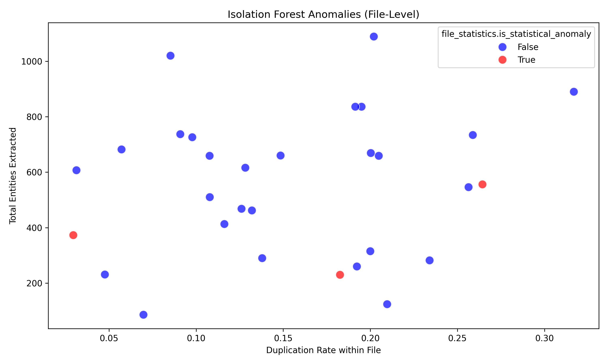

# Advanced Clinical AI Pipeline Report (V2)

## Executive Summary
Evaluation performed using the V2 framework incorporating Rule-Based heuristics, Vector Embeddings (Semantic Match), and Statistical Outlier detection.
Analyzed 30 patient charts.

**Overall Pipeline Quality**:
- Date Extraction Accuracy: 100.00%
- QA Attribute Completeness: 88.13%
- Files flagged as Statistical Anomalies: 3

---

## 2D Error Matrix

## Isolation Forest Output (Chart-level Outliers)

---

## Top Systemic Weaknesses
1. **Entity Type - PROCEDURE**: Failed 31.04% of the time.
2. **Temporality - CLINICAL_HISTORY**: Failed 19.33% of the time.
3. **Assertion - NEGATIVE**: Failed 19.15% of the time.
4. **Temporality - CURRENT**: Failed 17.84% of the time.
5. **Entity Type - SOCIAL_HISTORY**: Failed 13.65% of the time.

---
## Proposed Security & Reliability Guardrails
1. **Semantic Embeddings Fence**: Block entities passing downstream when their `sentence-transformer` cosine similarity scores to their canonical type are <0.15.
2. **Duplicate Extractor Limiter**: Abort pipeline if identical contextual triplets (Entity + Heading + Type) occur more than 5 times in a single chart.
3. **Strict Span Framing**: If `assertion` is POSITIVE, strictly enforce a 5-token trailing lookup for NegEx triggers over the exact original OCR block index.

*Generated by V2 Evaluation Ensemble Engine.*
