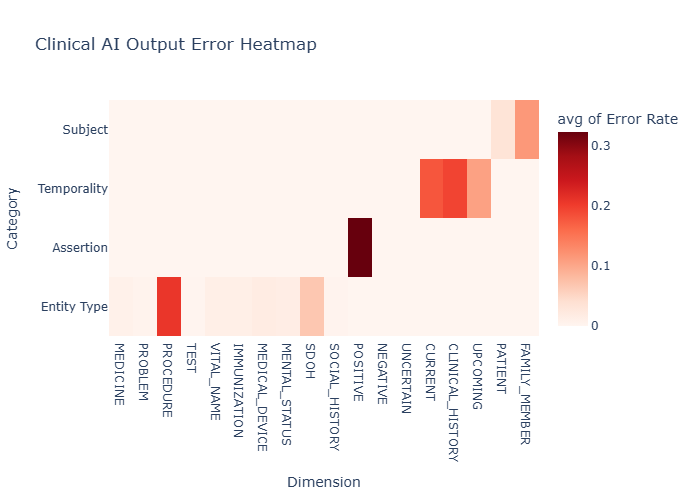

# Clinical AI Pipeline Evaluation Report

## Quantitative Evaluation Summary
Analyzed 30 patient charts. 

**Overall Pipeline Quality**:
- Average Event Date Accuracy: 100.00%
- Average Attribute Completeness: 88.13%

## Error Heatmap

### Error Rates by Dimension

| Category | Dimension | Error Rate |
|----------|-----------|------------|
| Assertion | POSITIVE | 32.21% |
| Assertion | NEGATIVE | 0.00% |
| Assertion | UNCERTAIN | 0.00% |
| Entity Type | PROCEDURE | 20.72% |
| Entity Type | SDOH | 6.78% |
| Entity Type | MEDICAL_DEVICE | 1.70% |
| Entity Type | MENTAL_STATUS | 1.48% |
| Entity Type | IMMUNIZATION | 1.23% |
| Entity Type | VITAL_NAME | 1.18% |
| Entity Type | MEDICINE | 0.81% |
| Entity Type | PROBLEM | 0.34% |
| Entity Type | SOCIAL_HISTORY | 0.33% |
| Entity Type | TEST | 0.20% |
| Subject | FAMILY_MEMBER | 11.47% |
| Subject | PATIENT | 3.30% |
| Temporality | CLINICAL_HISTORY | 19.33% |
| Temporality | CURRENT | 17.84% |
| Temporality | UPCOMING | 10.65% |
| Temporality | UNCERTAIN | 0.00% |

## Top Systemic Weaknesses
1. **Assertion - POSITIVE**: Failed 32.21% of the time.
2. **Entity Type - PROCEDURE**: Failed 20.72% of the time.
3. **Temporality - CLINICAL_HISTORY**: Failed 19.33% of the time.
4. **Temporality - CURRENT**: Failed 17.84% of the time.
5. **Subject - FAMILY_MEMBER**: Failed 11.47% of the time.

## Proposed Guardrails for Improving Reliability
Based on the failure modes observed, the following programmatic guardrails should be implemented in the pipeline:

1. **OCR Artifact Filtering**: Flag or remove entities whose text exactly matches section headers (e.g., "discharge summary", "medication list") or navigational cues ("patient", "encounter_date"). 
2. **Negation Cross-Validation**: If `assertion` == `POSITIVE`, scan the surrounding 5-10 words for negation triggers ("denies", "no", "without", "negative for"). If found, flip assertion to `NEGATIVE` or flag for human review.
3. **Temporal Inconsistency Checks**: If `temporality` == `CURRENT` but the heading contains "History" or text contains "past"/"resolved", flag as temporally ambiguous.
4. **Subject Context Matching**: Ensure entities found under "Family History" sections enforce `subject_error_rate` context bounds (e.g., must be `FAMILY_MEMBER`).
5. **Metadata Completeness Requirements**: Before passing `MEDICINE` entities downstream, validate that required QA attributes (STRENGTH, DOSE, ROUTE) are extracted, and fallback to regex-based parsing if missing.
